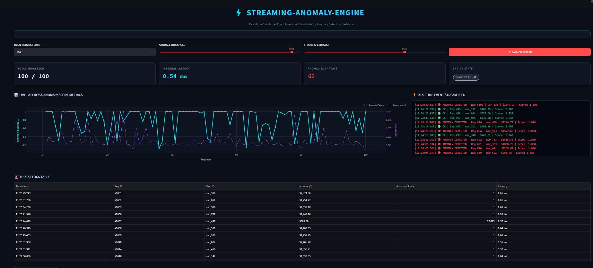

# ⚡ STREAMING-ANOMALY-ENGINE

A high-performance, real-time distributed event ingestion and low-latency anomaly detection dashboard built using **FastAPI** and **Streamlit**. Designed with a Cyberpunk/FinTech command-center aesthetic for real-time observability.

---

## 📸 System Overview & Live Dashboard

<p align="center">
  
</p>

---

## 🚀 Key Features

- **Low-Latency Engine**: Asynchronous FastAPI backend providing real-time anomaly score predictions.
- **Cyberpunk Command Center UI**: Custom dark-mode Streamlit interface with neon indicators and dynamic status badges.
- **Dual-Axis Dynamic Analytics**: Interactive Plotly graph tracking real-time API latency (ms) alongside anomaly scores.
- **Live Terminal Event Stream**: Auto-updating terminal feed showing incoming request payloads and status codes.
- **Threat Audit Logs**: Clean tabular view of detected anomalies with direct **CSV Export** report downloading.

---

## 🛠️ Tech Stack

- **Backend**: Python 3.10+, FastAPI, Uvicorn
- **Frontend**: Streamlit, Plotly, Custom CSS/HTML
- **Data Engineering**: Pandas, Requests

---

## 💻 Local Setup & Installation

### 1. Clone the Repository
```bash
git clone [https://github.com/gopals09920/streaming-anomaly-engine.git](https://github.com/gopals09920/streaming-anomaly-engine.git)
cd streaming-anomaly-engine